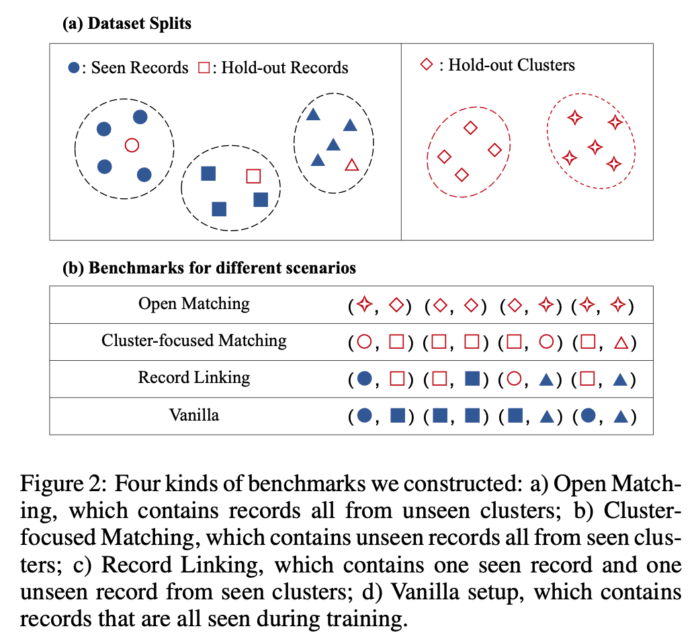

# Constructed Benchmarks

This directory holds the benchmarks we constructed, including four categories, four scenarios and corresponding imbalanced versions. For more information on this, please refer to the original [paper](https://arxiv.org/abs/2205.05889) and the following sections.

## Filename Explanation

For each category, we have a training set, validation set and eight test sets. The test sets include four scenarios (Vanilla, Record Linking, Cluster-focused Matching, and Open Matching) and their corresponding imbalanced versions.



The filename explanation is as follow:

```
.
├── datasets
│   ├── all/clothing/shoes/accessories
│   │   ├── train.parquet         <- Training Set
│   │   ├── val.parquet           <- Validation Set
│   │   ├── test.parquet          <- Vanilla Test Set
│   │   ├── test_rl.parquet       <- Record Linking Test Set
│   │   ├── test_cfm.parquet      <- Cluster-focused Matching Test Set
│   │   ├── test_om.parquet       <- Open Matching Test Set
│   │   ├── test_i.parquet        <- Imbalanced Version
│   │   ├── test_irl.parquet      <- Same as above
│   │   ├── test_icfm.parquet     <- Same as above
│   │   └── test_iom.parquet      <- Same as above
```

## Field Description

Each record consists of seven fields, as explained below:
```
id: Record ID
title: Product Title
pict_url: URL of Product Image
cate_level_name: Coarse Category
cate_name: Fine-grained Category
pv_pairs: Product Attributes, which split by #;# and #:#, for example "color#:#red#;#year#:#2022"
cluster_id: Cluster ID, record in the same cluster are considered to refer to the same product.
```

Each instance (record pair) consists of two records, distinguished by the suffixes "_left" and "_right", and the "label" field.

## Statistics

The statisstics of bechmarks is as follow:

<table>
<thead>
  <tr>
    <th></th>
    <th></th>
    <th>#Postive</th>
    <th>#Negtive</th>
    <th>#Total</th>
  </tr>
</thead>
<tbody align="center">
  <tr>
    <td rowspan="3">All</td>
    <td>Training</td>
    <td>1718</td>
    <td>5282</td>
    <td>7000</td>
  </tr>
  <tr>
    <td>Validation</td>
    <td>256</td>
    <td>744</td>
    <td>1000</td>
  </tr>
  <tr>
    <td>Vanilla Test</td>
    <td>526</td>
    <td>1474</td>
    <td>2000</td>
  </tr>
  <tr>
    <td rowspan="3">Shoes</td>
    <td>Training</td>
    <td>1732</td>
    <td>5268</td>
    <td>7000</td>
  </tr>
  <tr>
    <td>Validation</td>
    <td>248</td>
    <td>752</td>
    <td>1000</td>
  </tr>
  <tr>
    <td>Vanilla Test</td>
    <td>520</td>
    <td>1480</td>
    <td>2000</td>
  </tr>
  <tr>
    <td rowspan="3">Clothing</td>
    <td>Training</td>
    <td>1737</td>
    <td>5263</td>
    <td>7000</td>
  </tr>
  <tr>
    <td>Validation</td>
    <td>259</td>
    <td>741</td>
    <td>1000</td>
  </tr>
  <tr>
    <td>Vanilla Test</td>
    <td>504</td>
    <td>1496</td>
    <td>2000</td>
  </tr>
  <tr>
    <td rowspan="3">Accessories</td>
    <td>Training</td>
    <td>1721</td>
    <td>5279</td>
    <td>7000</td>
  </tr>
  <tr>
    <td>Validation<br></td>
    <td>250</td>
    <td>750</td>
    <td>1000</td>
  </tr>
  <tr>
    <td>Vanilla Test<br></td>
    <td>529</td>
    <td>1471</td>
    <td>2000</td>
  </tr>
</tbody>
</table>
<table>
<thead>
  <tr>
    <th></th>
    <th>#Postive</th>
    <th>#Negtive</th>
    <th>#Total</th>
  </tr>
</thead>
<tbody align="center">
  <tr>
    <td>Test (RL, CFM, OM)</td>
    <td>500</td>
    <td>1500</td>
    <td>2000</td>
  </tr>
  <tr>
    <td>Imbalanced Version</td>
    <td>500</td>
    <td>49500</td>
    <td>50000</td>
  </tr>
</tbody>
</table>
